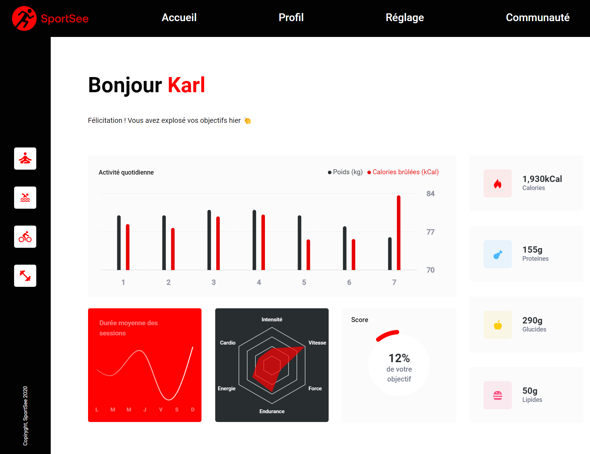

# SportSee


Projet 12 du parcours "**Développeur d'application - JavaScript React**" chez [OpenClassroom](https://openclassrooms.com/fr/).

## Description

Développez un tableau de bord d'analytics avec React



Vous travaillez en tant que développeur chez SportSee, une startup dédiée au coaching sportif. En pleine croissance, l’entreprise va aujourd’hui lancer une nouvelle version de la page profil de l’utilisateur. Cette page va notamment permettre à l’utilisateur de suivre le nombre de sessions réalisées ainsi que le nombre de calories brûlées.

## Installation

Ce projet a été testé et réalisé avec la version 20.15.1 de Node.js

### Partie Back

Cette partie utilise de préférence yarn, cependant, vous pouvez également le faire avec npm, ou passer par docker (pour cela je vous recommande de suivre le [README](./back/README.md#3-project-with-docker) du back).

Installer les dépendances :

```
cd back
yarn
```

Lancer le back :

```
cd back
yarn start
```

### Partie Front

Dans un nouveal terminal :

```
cd front
npm install
```

Et lancer le projet avec :

```
npm run dev
```

## Lancement

Si vous avez déjà installé les dépendances, vous pouvez directement lancer la partie back et la partie front depuit la racine du projet avec :

```
npm run back
```

et

```
npm run front
```

## Documentation

La documentation a été réalisé en utilisant la syntaxe de jsdoc, permettant à la fois d'être directement lisible par Visual Studio Code,
qui affiche un tooltip lorsque la souris passe sur un élément avec une documentation jsdoc, mais également de générer "automatiquement"
un document html.

La documentation est accessible [ici](https://code9g.github.io/SportSee/)

[](<[http://](https://github.com/code9g/)>)
[](https://www.linkedin.com/in/pierre-andre-henry/)
